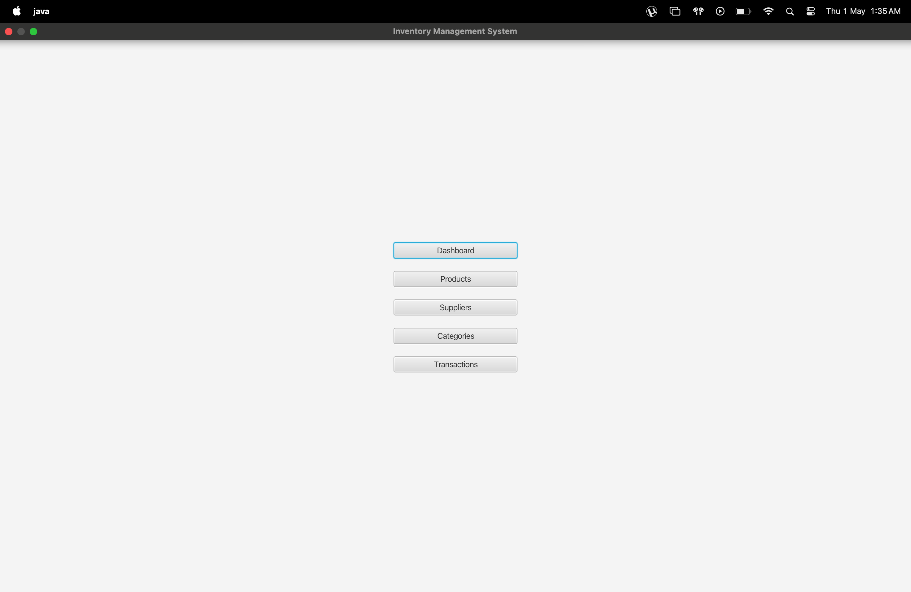
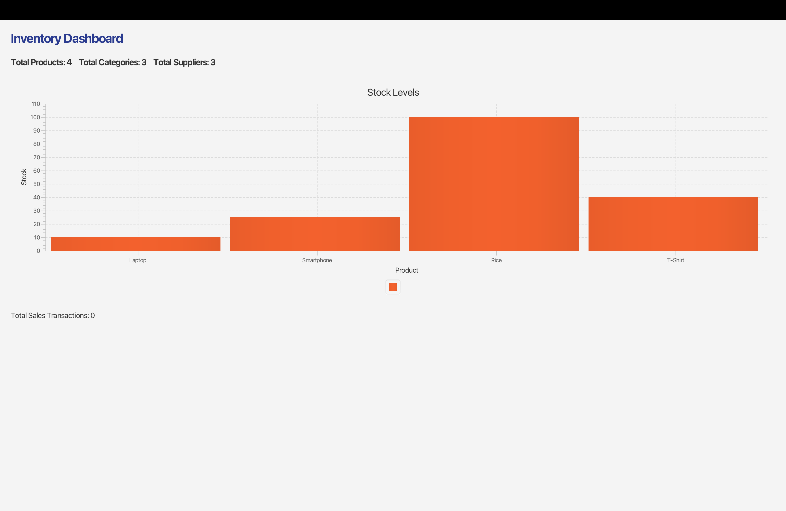
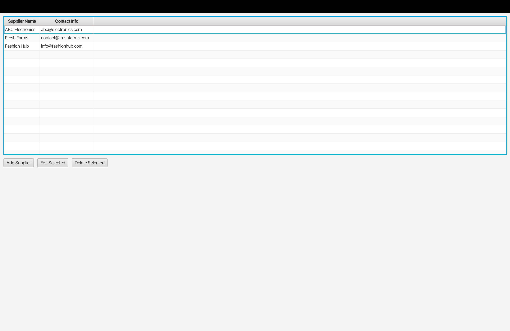
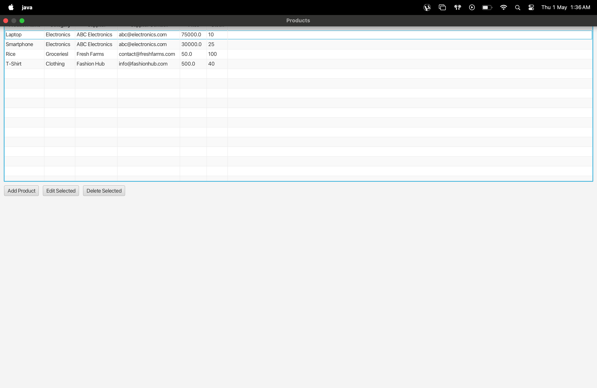

<p align="center">
  
  
  
  
  
  
</p>

<!-- Animated SVG Divider -->
<div align="center">
  
</div>

<h1 align="center">Inventory Management System</h1>

A professional JavaFX desktop application for managing inventory, suppliers, categories, and transactions. Built using JavaFX for the UI, MySQL for persistent storage, and follows best practices in software architecture (MVC, DAO patterns).

## Features
- Manage products, categories, suppliers, and transactions
- Dashboard with stock and sales analytics (JavaFX charts)
- Intuitive forms and navigation
- Real-time data updates and validation
- Reporting module with export (CSV/PDF)

## Technology Stack
- Java 17+
- JavaFX 21+
- MySQL 9+
- Maven (dependency management)

## Prerequisites
- Java JDK 17 or higher
- Maven
- MySQL server (installed via Homebrew recommended for macOS)

## Setup Instructions

### 1. Clone the Repository
```sh
git clone <repo-url>
cd inventory_management
```

### 2. Install MySQL (macOS/Homebrew)
```sh
brew install mysql
brew services start mysql
```

### 3. Secure MySQL & Set Root Password
```sh
mysql_secure_installation
```
- Set a strong password for the root user (e.g., `Elan@1408`).
- Remember this password; you will need it for configuration.

### 4. Configure Database Connection
Edit `src/main/java/db/DBConfig.java`:
```java
public static final String USER = "root";
public static final String PASSWORD = "<your_mysql_password>";
public static final String URL = "jdbc:mysql://localhost:3306/inventory_management";
```

### 5. Create the Database and Tables
```sh
mysql -u root -p -e 'CREATE DATABASE IF NOT EXISTS inventory_management;'
mysql -u root -p inventory_management < db/schema.sql
```

### 6. Load Sample Data (Optional)
```sh
mysql -u root -p inventory_management < db/sample_data.sql
```

### 7. Build and Run the Application
```sh
mvn clean javafx:run
```

## Troubleshooting
- **Access denied for user 'root'@'localhost':**
  - Ensure your password in `DBConfig.java` matches your MySQL root password.
  - MySQL server must be running: `brew services start mysql`
- **Database not found:**
  - Make sure you created `inventory_management` and imported the schema.
- **Port conflicts or MySQL won’t start:**
  - Kill stray MySQL processes: `sudo pkill -f mysqld`
  - Reinstall MySQL if needed.

## 📸 Application Screenshots

<p align="center">
  <b>App Dashboard</b> &nbsp;&nbsp;&nbsp;&nbsp;&nbsp;&nbsp;&nbsp;&nbsp;&nbsp;&nbsp;&nbsp;&nbsp;&nbsp;&nbsp;&nbsp;&nbsp;&nbsp;&nbsp;&nbsp;&nbsp;&nbsp;&nbsp;&nbsp;&nbsp;&nbsp;&nbsp;&nbsp;&nbsp;&nbsp;&nbsp;&nbsp;&nbsp;&nbsp;&nbsp;&nbsp;&nbsp;&nbsp;&nbsp;&nbsp;&nbsp; <b>Product Form</b><br>
  
  <br><br>
  <b>Supplier Management</b> &nbsp;&nbsp;&nbsp;&nbsp;&nbsp;&nbsp;&nbsp;&nbsp;&nbsp;&nbsp;&nbsp;&nbsp;&nbsp;&nbsp;&nbsp;&nbsp;&nbsp;&nbsp;&nbsp;&nbsp;&nbsp;&nbsp;&nbsp;&nbsp;&nbsp;&nbsp;&nbsp;&nbsp;&nbsp;&nbsp;&nbsp;&nbsp;&nbsp;&nbsp;&nbsp;&nbsp;&nbsp;&nbsp;&nbsp;&nbsp; <b>Reports Export</b><br>
  
  
</p>

---

## 📄 License
This project is licensed under the [MIT License](LICENSE).

## Credits
- Developed by [Your Name/Team]
- JavaFX, MySQL, Maven

---
For detailed project information, see `REPORT.md`.


## Overview
A modern Inventory Management System for retail/warehouse settings, built with **JavaFX** for the UI and **MySQL** for robust data storage. Easily track products, stock levels, suppliers, and sales with intuitive dashboards and visual analytics.

---

## Features
- **Product & Category Management**
- **Supplier Information Tracking**
- **Sales & Transaction History**
- **Real-time Stock Monitoring & Alerts**
- **Visual Charts & Trend Analysis**
- **Comprehensive Reports**

---

## Technologies Used


---

## Setup Instructions
1. **Clone the repository:**
   ```bash
   git clone https://github.com/your-org/inventory-management.git
   ```
2. **Install MySQL** and create the database:
   ```sql
   CREATE DATABASE inventory_db;
   USE inventory_db;
   -- Run the schema.sql script in /db
   ```
3. **Configure DB connection:**
   - Edit `db/DBConfig.java` with your MySQL credentials.
4. **Build & Run:**
   - Import project into your IDE (IntelliJ/Eclipse/VSCode)
   - Run `Main.java`

---

## 👥 Team & Contributions
| Name           | Role                | GitHub         |
|----------------|---------------------|----------------|
| Abhishek       | Backend             | @abhi-1408-shek|
| Khushmeet Singh| Frontend, Charts    | @member2       |
| Vardaan Sharma | DB & Integration    | @member3       |
| Anubhav Dubey  | Reports, Testing    | @member4       |
| Pranshu Sharma | UI/UX, Docs         | @member5       |

---

## Screenshots


---

## Contribution Guide
- Fork, branch (`feature/your-name`), PR
- Use clear commit messages
- Review and test before merging

---

## 📄 License
MIT License
